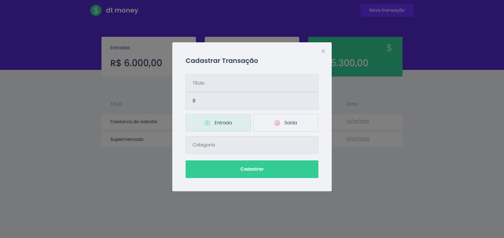

# DT money
<h2>Descrição do Projeto</h2>
<p align="center">
Aplicação desenvolvida durante o segundo capitulo do Ignite React, onde foi utilizado conceitos como context api e hooks, além de utilizar a biblioteca  Mirage Js para simular uma api.
</p>

<h1 align="center">
  
</h1>
<h2>Pré-requisitos</h2>

Antes de começar, você vai precisar ter instalado em sua máquina as seguintes ferramentas:
[Git](https://git-scm.com) e [React](https://pt-br.reactjs.org/).
Além disto é bom ter um editor para trabalhar com o código como [VSCode](https://code.visualstudio.com/).

# 🎲 Rodando o Front-End

```bash
# Clone este repositório
$ git git@github.com:rosana-moreira/DTmoney.git

# Acesse a pasta do projeto no terminal/cmd
$ cd DTmoney

# Instale as dependências
$ yarn

# Execute a aplicação em modo de desenvolvimento
$ yarn start

# O servidor do front-end inciará na porta::3000- acesse <http://localhost::3000>
```
